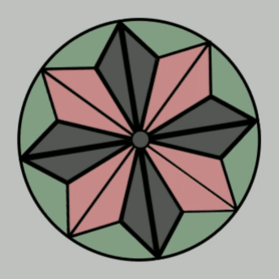

# Fidget Spinner

This app was created as a functional, portable, and free fidget spinner that is available at all times on my website, with the direct link [here](https://fidget-spinner.patrickgendotti.now.sh/). It is simple and easy to use, and can generate interesting visual patterns using my logo as it spins and slows down.

## Usage

The app is simple and intuitive to use - you just click on the logo and hold the left mouse button down while moving the mouse in the direction you want the fidget spinner to rotate. You can then release the left mouse button in order to start the fidget spinner's rotation, or move the cursor outside of the logo's image on the screen. If you move the cursor faster, the fidget spinner will rotate faster. The same instructions apply for a touchscreen - you just substitute the mouse clicks and cursor for your finger on the screen.

    

### Loading Different Spinners

One of the primary features to be added to this app is different logos or images that can be spun - round or otherwise. In fact, an addition on top of this would be to enable custom image loading for your own fidget spinners, where the user can drag and drop or otherwise add images that can be spun to a fidget spinner session. The base code for this application will likely be reused in further apps planned, such as a roulette wheel, or spinner "input" for a game or decision matrix.

## Dependencies

This application is relatively simple, and only uses one framework -  [Angular](https://angularjs.org/) version 8.3.26 with [TypeScript](https://www.typescriptlang.org/) 3.5.3

## Further Development

I am currently looking at adding a gallery of different fidget spinners to choose from, as a "basic" spinner pack. You will be able to select the image of one of these built-in spinners to use that spinner.

I am also planning on adding an inversion pulse feature, that inverts the spinner image repeatedly at a frequency given by the user.

Another new feature that I want to add is a background color behind the spinner and an opacity property to the spinner image, to make custom color blends possible. This feature can be augmented by changing the background color at a certain frequency, maybe to use background colors and maybe to loop through selected colors. This feature is more advanced than the other new features mentioned here, so it will likely debut last.

 I will likely add this to the rangoli as an option for rotation besides the soon-to-be-released standard constant spin feature.
