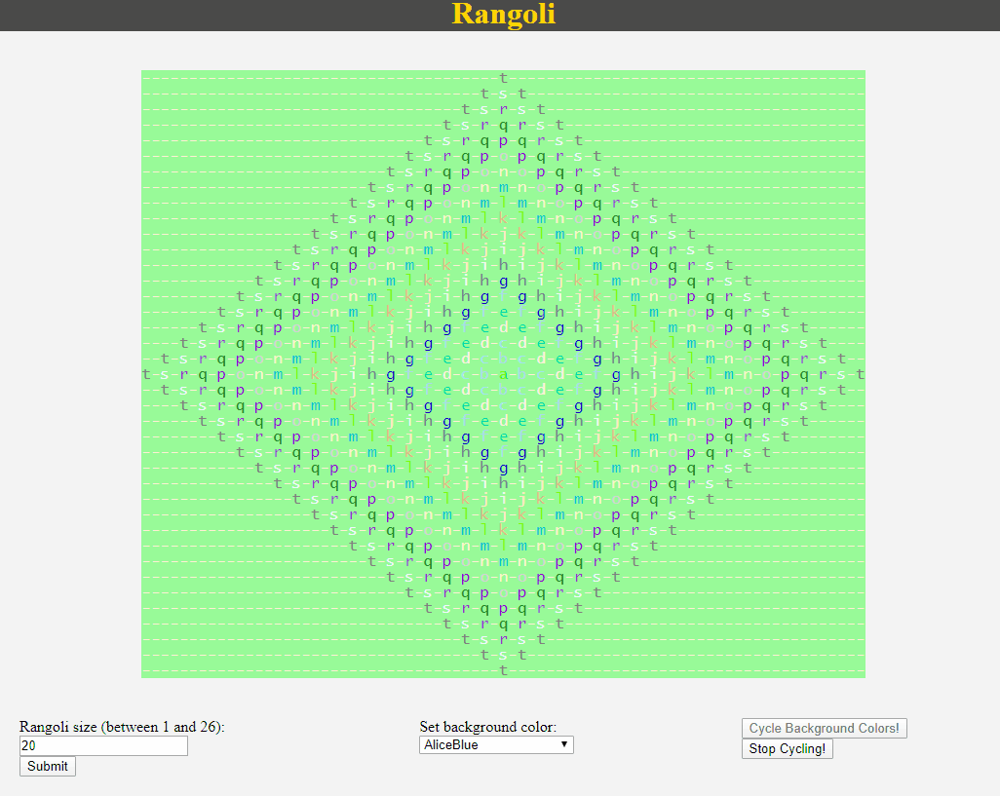

# Rangoli App

This application was created as an extension of a HackerRank Python language problem available [here](https://www.hackerrank.com/challenges/alphabet-rangoli/problem) that I solved using Python's custom formatting feature.

Diamond patterns are created using letters in the alphabet as per the problem
statement, but I added the randomized coloring of the letters for each newly-generated rangoli. This randomized coloring of each diamond means that a user of the app could preview some of the possible combinations of colors, especially by changing the Rangoli background color, to see how they complement or contrast one another.

I personally find cycling through the colors randomly makes different colors stand out or blend with the background, creating a neat, captivating effect!

## Usage

The rangoli initially shown is a size 5 rangoli, and appears with randomized colors already selected. To generate a new rangoli, set the "Rangoli size" input to a value between 1 and 26, inclusive, and then click the "Submit" button. A new rangoli of the specified size with randomized colors should appear within a couple of seconds. These rangolis are always approximately the same size in the application, meaning that they occupy the same amount of screen space, with the individual character size expanding or shrinking depending on the number of characters used (e.g. a size 1 rangoli has the largest character size used, and a size 26 rangoli has the smallest character size used).

To change the background color of the rangoli, a user simply needs to select their desired color from the available options besides the "Set background color" text. The colors are listed in alphabetical order, and the background color of each option serves as a preview of the color.

To change the color of a character of the rangoli, a user simply needs to click on one of the characters and then select their desired color from the available options besides the "Set character color" text. The colors are listed in alphabetical order, and the background color of each option serves as a preview of the color. A random color can also be set by clicking the "Random" button, or by hitting the 'r' key on the keyboard as a shortcut. Setting the color for one character will change the color of all identical characters to the new color.

To randomly cycle through background colors for a particular rangoli, click the "Cycle Background Colors!" button. This action will cause the background colors of the rangoli to randomly change to different colors, which can allow the user to see an array of different color combinations clearly for optimal color selection and coordination, and also to view interesting patterns possible given the different colors of each diamond and how they interact with their spacing and neighboring diamond pattern colors. I personally think rangolis of size 10-15 are the best for color selection since the letters are large enough for the contrast or blend to be clearly seen and there are lots of colors that can be compared, but larger rangolis are also useful for seeing how the different diamond colors can form patterns.

## Dependencies

This application is built using the [Angular](https://angularjs.org/) version 8.2.14 framework with [TypeScript](https://www.typescriptlang.org/) 3.5.3 and also uses the [WayScript](https://wayscript.com/) service to run a Python script to generate the rangolis using a custom API.

## Further Development

At some point, the layout will be upgraded to use a more professional, stylized interface with an HTML and CSS framework like Bulma or Bootstrap.
